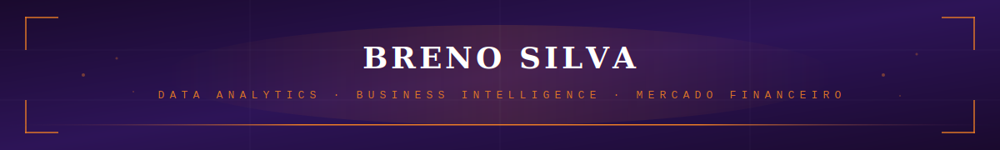

<!-- TOPO -->

<!-- Frase de efeito com digitação -->

  

  

---
<!-- Sobre mim -->

 Data Analytics | Business Intelligence | Mercado Financeiro

 
Base técnica em desenvolvimento de sistemas e forte direcionamento para análise de dados aplicados a negócio.
Interesse em indicadores de performance, análise de crédito, inteligência comercial e soluções orientadas a dados para o setor financeiro.
  
---

<!-- Estudos -->

  <ul>
    <li>Análise de Dados</li>
    <li>Business Intelligence (BI)</li>
    <li>Mercado Financeiro</li>
    <li>Inteligência Artificial & Inteligência Comercial</li>
  </ul>

---

<!-- Habilidades Técnicas -->

| 📊 Dados & BI | 💻 Desenvolvimento | 🔧 Ferramentas |
|---|---|---|
| SQL | JavaScript | Git |
| Python | TypeScript | GitHub |
| Análise de Dados | Node.js | |
| Modelagem Relacional | React | |
| Power BI & Excel | Integração de APIs | |

  
---

<!-- Certificações -->
- 🎓 Análise e Desenvolvimento de Sistemas - UNIGRAN
- 🎓 Pós Graduação, Especialização em Análise de Dados e Inteligência Artificial - Preditiva Analytics

 

---
  
<!-- Tecnologias -->
<!-- DADOS & BI -->
<h4 align="center">Dados & BI</h4>

  
    
  
  
    
  

<!-- BACKEND -->
<h4 align="center">Backend</h4>

  
    
  
  
    
  

<!-- FRONTEND -->
<h4 align="center">Frontend</h4>

  
    
  
  
    
  
  
    
  
  
    
  

---

 
  
  
  

---

  

---

> _“Tecnologia move o mundo.” – Steve Jobs_  
> Sempre aberto a desafios, projetos e colaborações!
 
<!-- RODAPÉ -->

